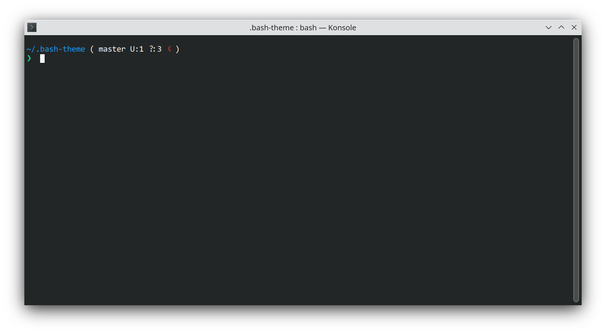

# bash-theme
Simple bash customization

## clone

```
git clone git@github.com:gamunu/bash-theme.git ~/.bash-theme
```

## include init.sh in bashrc

```bash
echo "source ~/.bash-theme/init.sh" >> ~/.bashrc
```

# Preview


